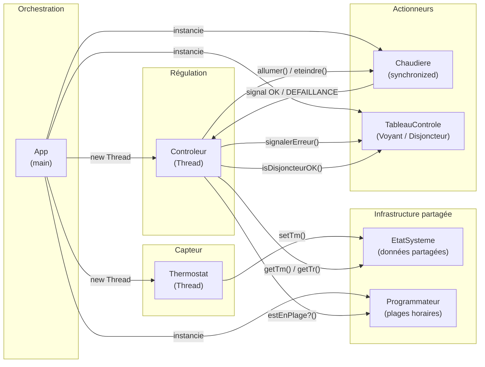
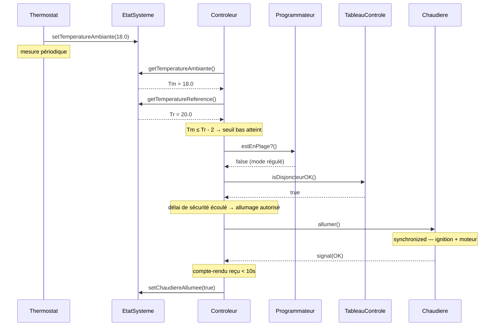
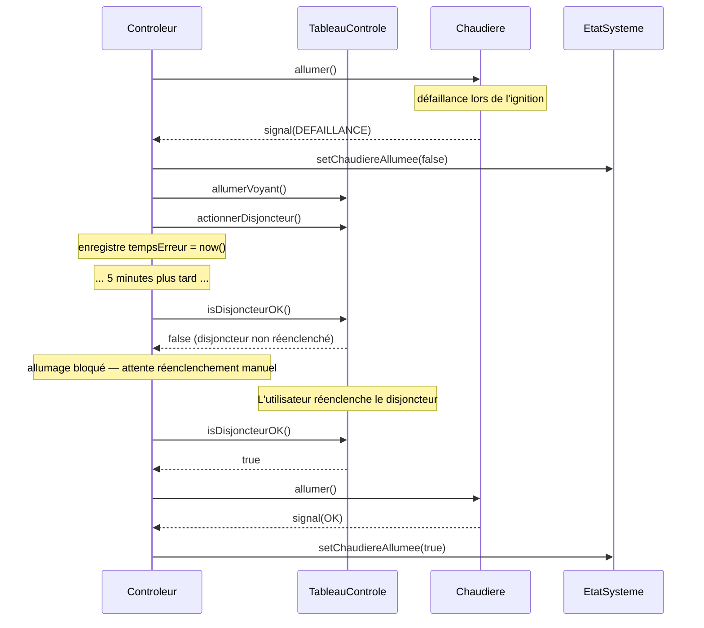

PALANCA Clement
DUQUENOY Taina
CAGNON Leny

# Compte Rendu de TP : Implémentation d'une Architecture Logicielle et Simulation de Pilotage de Température

## 1. Architecture Logicielle

### Schéma Composants/Connecteurs



> L'`EtatSysteme` est le **dépôt central partagé** du système. Le `Controleur` est le composant central de décision, il consulte le thermostat (via le dépôt), le programmateur et le tableau de contrôle pour décider de l'allumage ou de l'arrêt de la chaudière. L'utilisateur est un acteur **externe** au système : il paramètre `Tr`, les plages horaires et le disjoncteur.

---

## 2. Implémentation du Dépôt Partagé

Le cœur du système repose sur la classe `EtatSysteme`.

### Choix 1 : Séparation `EtatSysteme` / `Controleur`

L'`EtatSysteme` est volontairement limité au stockage des données partagées : température ambiante `Tm`, température de référence `Tr`, et état de la chaudière (`allumée` / `éteinte`). `Tm` est comparé à `Tr ± 2°`, la vérification des plages horaires et gestion du protocole d'allumage est encapsulée dans le `Controleur`. Ce découplage correspond au style **données partagées** : le thermostat écrit `Tm`, l'utilisateur écrit `Tr`, et le contrôleur lit les deux sans couplage direct avec les producteurs.

### Choix 2 : Protocole d'allumage avec timeout

Lors de l'allumage, le contrôleur envoie un signal à la chaudière puis attend un compte-rendu pendant **10 secondes**. Trois issues sont possibles : compte-rendu de bon fonctionnement (la chaudière est enregistrée comme allumée), compte-rendu de défaillance ou absence de réponse (la chaudière est enregistrée comme non allumée, le voyant est activé, le disjoncteur est actionné). Après une erreur, toute nouvelle tentative est bloquée pendant **5 minutes** et subordonnée au réenclenchement manuel du disjoncteur.

---

## 3. Modélisation des Agents et Automates d'États

### Spécification Formelle des Agents

Les agents sont décrits ci-dessous dans une notation inspirée du formalisme Linda. Le symbole `←` désigne une liaison de résultat, et `^ω` indique une boucle d'exécution.

**État initial du système** :

```
EtatSysteme₀ = { Tm = 20.0, Tr = 20.0, chaudiereAllumee = false }
Programmateur₀ = { plages = [] }
TableauControle₀ = { voyant = false, disjoncteur = true }
```

---

**Agent Thermostat(intervalle)**

```
Agent Thermostat(intervalle)
  ^ω
    Tm ← simulerTemperature().                     -- mesure ou simulation
    EtatSysteme.setTemperatureAmbiante(Tm).         -- écriture dans le dépôt partagé
    sleep(intervalle).
```

---

**Agent Controleur(intervalle)**

```
Agent Controleur(intervalle)
  ^ω
    Tm ← EtatSysteme.getTemperatureAmbiante().
    Tr ← EtatSysteme.getTemperatureReference().
    enPlage ← Programmateur.estEnPlage?().

    ([ enPlage = true ∧ chaudiereAllumee = false ]
        → tenterAllumage().                         -- mode programmé prioritaire

    +[ enPlage = false ]
        ([ Tm ≤ Tr - 2 ∧ chaudiereAllumee = false ]
            → tenterAllumage().                     -- seuil bas atteint
        +[ Tm ≥ Tr + 2 ∧ chaudiereAllumee = true ]
            → Chaudiere.eteindre().                 -- seuil haut atteint
            EtatSysteme.setChaudiereAllumee(false).
        )
    )
    sleep(intervalle).
```

---

**Agent Controleur.tenterAllumage()**

```
Controleur.tenterAllumage()
  [ TableauControle.isDisjoncteurOK() = false ]
      → rejet (disjoncteur non réenclenché)

  [ tempsDepuisErreur < 5 minutes ]
      → rejet (délai de sécurité non écoulé)

  Chaudiere.allumer().
  compteRendu ← attendreCompteRendu(timeout = 10s).

  ([ compteRendu = OK ]
      EtatSysteme.setChaudiereAllumee(true).
  +
  [ compteRendu = DEFAILLANCE ∨ compteRendu = TIMEOUT ]
      EtatSysteme.setChaudiereAllumee(false).
      TableauControle.allumerVoyant().
      TableauControle.actionnerDisjoncteur().
      enregistrerTempsErreur().
  )
```

---

**Agent Chaudiere.allumer()**

```
Chaudiere.allumer()
  synchronized:
    ignition().
    miseEnRouteMoteur().
    ([ succès ]
        → envoyerSignal(OK)
    +[ défaillance ]
        → envoyerSignal(DEFAILLANCE)
    )
```

> Le mode programmé est **prioritaire** sur le mode régulé : si une plage horaire est active, la chaudière reste allumée indépendamment du dépassement du seuil de température.

---

### Le Thermostat

Le `Thermostat` joue le rôle de **capteur** du système (sensor dans la boucle de rétroaction). Il mesure périodiquement la température ambiante (simulée) et l'écrit dans le dépôt partagé `EtatSysteme`. Il n'a aucune logique de décision, il se contente de produire des données.

### Le Contrôleur

Le `Controleur` est le **régulateur** du système. Il lit périodiquement `Tm` et `Tr` depuis le dépôt partagé, consulte le `Programmateur` pour vérifier si une plage horaire est active, et décide d'allumer ou d'éteindre la chaudière. Il implémente le protocole d'allumage avec timeout et gère les états d'erreur (voyant, disjoncteur, délai de 5 minutes).

### La Chaudière

La `Chaudiere` est l'**actionneur** du système. Sa méthode `allumer()` est synchronisée et simule l'ignition suivie de la mise en route du moteur. Elle envoie un signal de compte-rendu au contrôleur (OK ou DEFAILLANCE).

### Le Tableau de Contrôle

Le `TableauControle` gère le **voyant d'erreur** et le **disjoncteur**. Le voyant s'allume en cas de défaillance de la chaudière. Le disjoncteur se déclenche automatiquement en cas d'erreur et doit être réenclenché manuellement par l'utilisateur avant toute nouvelle tentative d'allumage.

### Le Programmateur

Le `Programmateur` gère les **plages horaires** définies par l'utilisateur. Il expose une méthode `estEnPlage?()` qui retourne `true` si l'heure courante se trouve dans une plage programmée. Le mode programmé est prioritaire sur le mode régulé.

---

### Schéma de Séquence

Le diagramme ci-dessous illustre le protocole complet pour un cycle de régulation (cas nominal : allumage réussi) :



Le diagramme ci-dessous illustre le cas d'erreur (défaillance de la chaudière) :



> Si le contrôleur ne reçoit aucun signal dans les 10 secondes (timeout), le comportement est identique à une défaillance : voyant allumé, disjoncteur actionné, délai de 5 minutes imposé.

---

## 4. Validation par Scénarios d'Intégration

La méthode `App.main` couvre quatre cas limites :

### Scénario 1 - Régulation normale (seuil bas)
La température ambiante descend à 18°C alors que la référence est à 20°C. Le contrôleur détecte que `Tm < Tr - 2`, tente l'allumage, reçoit un compte-rendu OK, et la chaudière chauffe jusqu'à ce que `Tm ≥ Tr + 2` (22°C).

### Scénario 2 - Défaillance et reprise
La chaudière signale une défaillance lors de l'allumage. Le contrôleur allume le voyant, actionne le disjoncteur, et bloque toute tentative pendant 5 minutes. Après expiration du délai et réenclenchement manuel du disjoncteur par l'utilisateur, le contrôleur réussit à allumer la chaudière. Ce scénario valide le protocole d'erreur complet.

### Scénario 3 - Mode programmé prioritaire
Une plage horaire est définie de 6h à 8h. Pendant cette plage, la température ambiante dépasse `Tr + 2` mais la chaudière reste allumée car le mode programmé est prioritaire. À 8h, le mode régulé reprend et la chaudière est éteinte. Ce scénario valide la priorité du mode programmé sur le mode régulé.

### Scénario 4 - Timeout du compte-rendu
La chaudière ne répond pas dans les 10 secondes après l'ordre d'allumage. Le contrôleur traite cette absence de réponse comme une défaillance : voyant allumé, disjoncteur actionné, délai de 5 minutes. Ce scénario valide la gestion du timeout, distincte de la défaillance explicite.